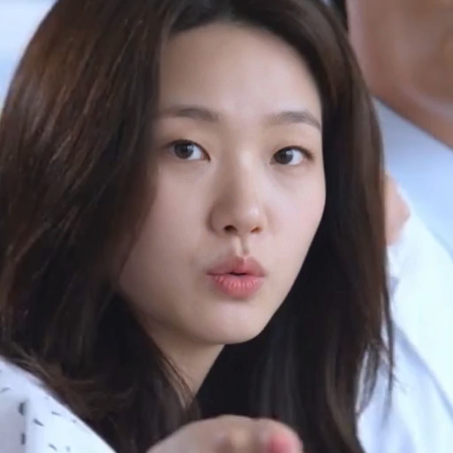
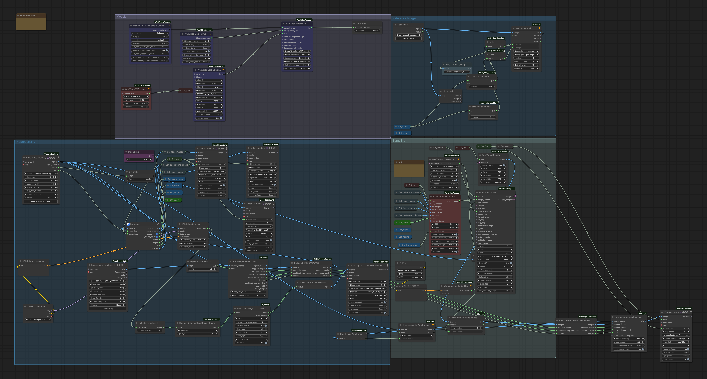

# Wan Animate + SAM3 Head Matchmove

SAM3로 인물의 헤드 영역을 추적·고정한 뒤, 안정화된 정방형 crop에서 Wan Animate Face Only를 실행하고, 결과를 원본 좌표·스케일로 되돌려 합성하는 ComfyUI 워크플로우입니다.

후반 프레임 드리프트를 막기 위해 검증한 `00003` B/W SAM3 마스크 MP4를 고정 입력으로 사용합니다.

## 원본 · Face Only 결과 · Reference

아래 비교는 같은 시점의 프레임입니다. 왼쪽은 원본, 오른쪽은 Wan Animate Face Only 결과를 원본에 matchmove한 영상입니다.

<p align="center">
  
</p>

| 원본 영상 | Face Only / Matchmove 결과 |
| --- | --- |
| [`inputs/clip_001_reverse.mp4`](inputs/clip_001_reverse.mp4) | [`renders/wan-animate-sam3-head-matchmove_frozen-sam3-mask_00003_640-square.mp4`](renders/wan-animate-sam3-head-matchmove_frozen-sam3-mask_00003_640-square.mp4) |

Reference로 넣은 얼굴 이미지입니다.

<p align="center">
  
</p>

[원본 reference 이미지 보기](reference/reference-face.png)

## 640 × 640 샘플 결과

<p align="center">
  
</p>

[640 결과 영상 보기](renders/wan-animate-sam3-head-matchmove_frozen-sam3-mask_00003_640-square.mp4)

## 해상도 설정

해상도는 워크플로우의 crop/resize 입력에서 바꿀 수 있습니다. 최종 합성 MP4는 원본 프레임 크기로 출력됩니다.

| Wan 정방형 처리 크기 | 권장 상황 |
| --- | --- |
| **640 × 640** | 기본 권장. 속도와 안정성의 균형이 가장 좋습니다. |
| **720 × 720** | VRAM 여유가 있을 때 디테일 확인용입니다. |
| **1024 × 1024** | 실험용. VRAM과 렌더 시간이 크게 증가할 수 있습니다. |

## Frozen SAM3 B/W 마스크

원본 해상도의 B/W 헤드 마스크 MP4입니다. 작은 떠다니는 성분을 제거한 뒤 고정 입력으로 사용해, 재추적 시 발생할 수 있는 후반부 트래킹 드리프트를 피합니다.

<p align="center">
  
</p>

[B/W 마스크 MP4 보기](masks/sam3-head-mask_00003.mp4)

## 워크플로우 구조

```text
원본 영상
  └─ SAM3 Head Tracking → Frozen B/W Mask MP4
       └─ Square Crop + Stabilize
            └─ Wan Animate Face Only (640 기본)
                 └─ Inverse Crop / Matchmove Composite → 최종 MP4
```

<p align="center">
  
</p>

## 파일 안내

| 경로 | 용도 |
| --- | --- |
| [`workflows/wan-animate-sam3-head-matchmove_frozen-sam3-mask_00003.json`](workflows/wan-animate-sam3-head-matchmove_frozen-sam3-mask_00003.json) | ComfyUI 워크플로우 |
| [`inputs/clip_001_reverse.mp4`](inputs/clip_001_reverse.mp4) | 비교용 원본 영상 |
| [`reference/reference-face.png`](reference/reference-face.png) | Wan Animate reference 얼굴 이미지 |
| [`masks/sam3-head-mask_00003.mp4`](masks/sam3-head-mask_00003.mp4) | 원본 크기 B/W 헤드 마스크 |
| [`renders/`](renders/) | Face Only / Matchmove 결과 영상 |

## 사용 순서

1. `workflows`의 JSON을 ComfyUI로 불러옵니다.
2. `Frozen good SAM3 mask (00003)` 노드에 `masks/sam3-head-mask_00003.mp4`를 지정합니다.
3. 원본 영상과 reference 얼굴 이미지를 교체합니다.
4. crop/resize 입력을 640, 720, 1024 등 원하는 정방형 크기로 맞춥니다. 기본값은 640입니다.
5. 실행하면 crop에서 Face Only 처리 후, 원본 해상도로 matchmove 합성됩니다.
