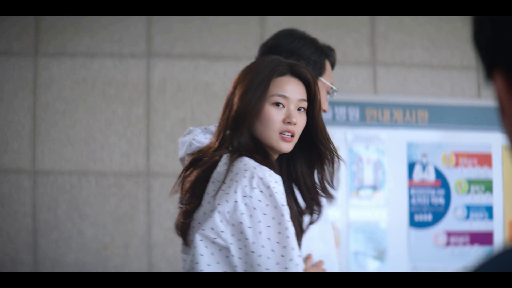

# Wan Animate × SAM3 Head Matchmove

Wan Animate FaceOnly 결과를 원본 영상에 다시 매치무브하는 ComfyUI 워크플로우입니다.<br>
SAM3가 잡은 **정방형 헤드 영역**만 Wan으로 처리한 뒤, 원본 프레임 크기로 되돌려 합성합니다.

> 이 버전은 SAM3가 후반 프레임에서 얼굴을 놓치는 문제를 피하기 위해, 검증된 `00003` 트랙을 B/W 마스크 MP4로 고정해 사용합니다.

## 결과 미리보기

<table>
  <tr>
    <td width="50%"><b>640 × 640 Wan 처리</b><br></td>
    <td width="50%"><b>720 × 720 Wan 처리</b><br></td>
  </tr>
</table>

- [640 결과 영상 보기](renders/wan-animate-sam3-head-matchmove_frozen-sam3-mask_00003_640-square.mp4)
- [720 결과 영상 보기](renders/wan-animate-sam3-head-matchmove_frozen-sam3-mask_00003_720-square.mp4)

## 고정 SAM3 마스크

검정은 배경, 흰색은 합성·크롭에 사용할 헤드 영역입니다. 이 마스크를 고정 입력으로 두어, 영상 후반에도 헤드 위치와 스케일이 흔들리지 않게 합니다.

<p align="center">
  
</p>

- [B/W 마스크 MP4 보기](masks/sam3-head-mask_00003.mp4)

## 워크플로우 구조

```text
원본 영상
   ├─→ Frozen SAM3 Mask MP4 → 정방형 헤드 Crop / 안정화
   │                              ↓
   └────────────────────────→ Wan Animate FaceOnly (640 또는 720)
                                      ↓
                               원본 크기로 역변환
                                      ↓
                               Matchmove Composite
```

<p align="center">
  
</p>

## 파일 안내

| 경로 | 용도 |
| --- | --- |
| [`workflows/wan-animate-sam3-head-matchmove_frozen-sam3-mask_00003.json`](workflows/wan-animate-sam3-head-matchmove_frozen-sam3-mask_00003.json) | ComfyUI에서 열어 수정할 워크플로우 |
| [`masks/sam3-head-mask_00003.mp4`](masks/sam3-head-mask_00003.mp4) | 원본 크기 B/W 헤드 마스크 |
| [`renders/`](renders/) | 고정 트랙을 사용한 640 / 720 결과 |

## 사용 순서

1. `workflows`의 JSON을 ComfyUI로 불러옵니다.
2. `Frozen good SAM3 mask (00003)` 노드에 `masks/sam3-head-mask_00003.mp4`를 지정합니다.
3. 원본 영상과 얼굴 레퍼런스를 교체합니다.
4. Wan 처리 해상도는 `WanVideo Animate Embeds`와 레퍼런스 리사이즈 값을 같은 정방형 값으로 맞춥니다.
5. 실행 후 결과는 원본 해상도로 자동 합성됩니다.
ComfyUI Wan Animate SAM3 head matchmove workflows and reference outputs
